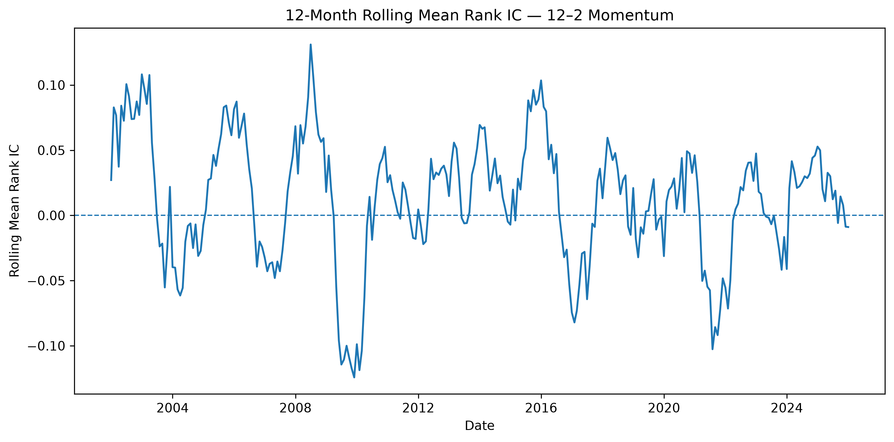
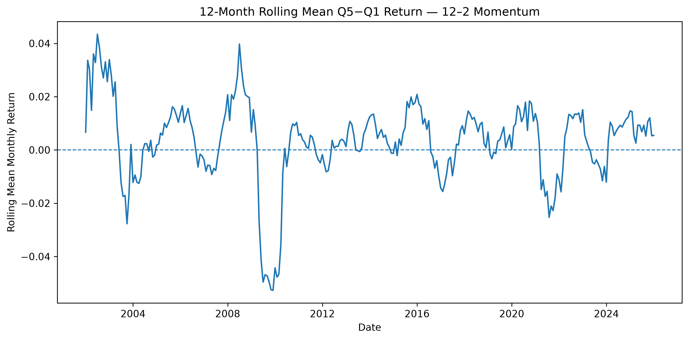
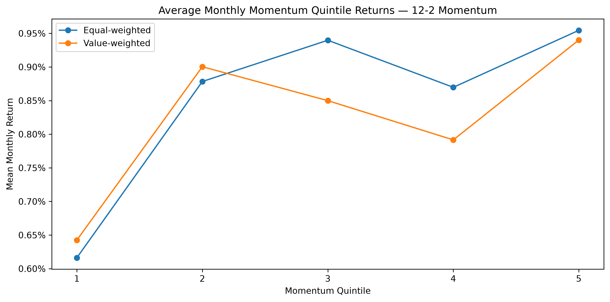

# Equity Factor Research Platform

A research-oriented Python project for studying cross-sectional equity factors using point-in-time data, portfolio sorts, predictive diagnostics, and robustness analysis.

The project currently focuses on a central empirical question:

> Does a conventional 12–2 momentum signal predict one-month-ahead U.S. stock returns, and is the relationship robust across time and reasonable portfolio construction choices?

Using monthly U.S. equity data from Compustat spanning 2000–2025, the analysis constructs a dynamic point-in-time universe of large U.S. common stocks, forms momentum signals without look-ahead bias, evaluates predictive strength using Rank IC and quintile portfolios, and tests robustness across weighting schemes, formation windows, and universe definitions.

The results show a modest positive momentum effect rather than strong statistical evidence: **higher-momentum stocks outperform lower-momentum stocks on average, but predictive strength is highly time-varying and substantially weaker after 2008**.

## Research Design

The baseline analysis studies monthly cross-sectional momentum in U.S. equities from January 2001 through December 2025, using January–December 2000 as a warm-up period for signal construction.

### Universe

Each month, the investable universe consists of the Top 1,000 eligible U.S. common stocks by lagged market capitalization. Exchange eligibility is restricted to NYSE, AMEX, and Nasdaq ordinary common stocks.

Universe membership for month $t$ is determined using information available at $t-1$, including lagged market capitalization and lagged eligibility status. This point-in-time construction is designed to avoid look-ahead bias while retaining securities that subsequently delist or become ineligible during the outcome month.

### Momentum Signal

The baseline factor is conventional 12–2 momentum:

* formation period: returns from $t-12$ through $t-2$
* skip month: $t-1$
* outcome return: month $t$

Missing monthly returns are not treated as zero, and signal construction requires calendar-month continuity.

### Evaluation

Momentum is evaluated using two complementary approaches:

* Rank IC: monthly Spearman correlation between the momentum signal and one-month-ahead stock returns.
* Portfolio sorts: securities are assigned to momentum quintiles each month, with performance measured using both equal-weighted and value-weighted portfolios.

The primary portfolio statistic is the monthly Q5 − Q1 spread, comparing the highest- and lowest-momentum quintiles.

### Robustness

The baseline specification is compared against several reasonable alternatives:

* 6–2 momentum instead of 12–2 momentum
* value-weighted instead of equal-weighted portfolios
* Top 500 and Top 1,500 universes around the Top 1,000 baseline

These checks are used to assess whether the main result depends heavily on a particular formation window, weighting scheme, or universe cutoff.

## Key Results

The baseline 12–2 momentum specification produces a **positive but statistically weak** relationship between past and subsequent stock returns.

| Metric                               | Baseline Result |
| ------------------------------------ | --------------: |
| Mean monthly Rank IC                 |          0.0122 |
| Rank IC t-statistic                  |            1.12 |
| Positive IC months                   |           54.7% |
| Equal-weighted Q5 − Q1 return        | 0.34% per month |
| Q5 − Q1 t-statistic                  |            1.05 |
| Annualized arithmetic Q5 − Q1 return |           4.06% |
| Annualized Q5 − Q1 volatility        |          19.27% |
| Positive Q5 − Q1 months              |           56.7% |

Higher-momentum stocks therefore outperform lower-momentum stocks on average, but the full-sample evidence is not strong enough to characterize momentum as statistically significant in this sample.

The effect is also highly time-varying. Rank IC is strongest in the earlier part of the sample and becomes much weaker after 2008, while the long-short portfolio experiences substantial momentum-reversal episodes.

The main directional result survives the planned robustness checks:

* value weighting reduces the Q5 − Q1 spread slightly but does not eliminate it;
* a 6–2 formation window produces the same positive direction, although more weakly;
* Top 500, Top 1,000, and Top 1,500 universes produce broadly similar results.

Overall, the evidence supports a modest and reasonably robust momentum relationship, rather than a strong or consistently reliable predictive signal.

## Main Figures

### Time-Varying Predictive Strength

The 12-month rolling mean Rank IC shows substantial variation in momentum's cross-sectional predictive strength over time. The relationship is stronger in parts of the earlier sample and weakens considerably in later years.



### Time-Varying Long-Short Performance

The equal-weighted Q5 − Q1 portfolio exhibits similarly pronounced time variation, including periods of strong momentum performance and substantial reversal episodes.



### Average Momentum Quintile Returns

Average portfolio returns generally favor higher-momentum stocks under both equal and value weighting, although the relationship across the middle quintiles is not perfectly monotonic.



## Data & Reproducibility

The reported empirical results use monthly U.S. equity data from Compustat. Because Compustat is a licensed proprietary data source, the raw data files are not included in this repository.

The empirical pipeline expects locally supplied Compustat extracts corresponding to:

* monthly security-level market data;
* historical exchange classifications; and
* security-level delisting information.

The current analysis uses the following local filenames:

```text
compustat_secm_2000_2025.csv.gz
compustat_sec_history_exchg.csv.gz
compustat_security.csv.gz
```

These files are kept outside the repository and are not tracked by Git.

The repository also contains a Sharadar-based data provider developed during the prototyping stage. It is useful for testing the research pipeline on accessible sample data, but the results reported in this README and in `docs/empirical_results.md` are based on the Compustat dataset.

To preserve point-in-time integrity, the data pipeline applies historical exchange classifications using their effective date ranges, constructs universe membership from lagged information, and incorporates delisting treatment without inferring information from future observations.

Users with access to equivalent security-level data can adapt the ingestion layer while retaining the downstream factor, portfolio, and analysis components.

### Data Attribution

The empirical analysis uses Compustat data from S&P Global Market Intelligence accessed through Wharton Research Data Services (WRDS). The underlying licensed Compustat data are not distributed with this repository; only research code, methodology, derived aggregate results, and figures generated from the analysis are included.

S&P Global Market Intelligence is the source of the underlying Compustat data and is not the source of the analysis, calculations, portfolio construction, or interpretation presented in this project.

**WRDS acknowledgement:**
Wharton Research Data Services (WRDS) was used in preparing this Equity Factor Research Platform. This service and the data available thereon constitute valuable intellectual property and trade secrets of WRDS and/or its third-party suppliers.

## Project Structure

```text
equity-factor-research-platform/
├── src/
│   └── equity_factor_research/
│       ├── analysis/
│       │   ├── portfolio_sorts.py
│       │   ├── rank_ic.py
│       │   └── robustness.py
│       ├── data/
│       │   ├── providers/
│       │   ├── quality.py
│       │   ├── schema.py
│       │   ├── transforms.py
│       │   └── universe.py
│       └── factors/
│           └── momentum.py
├── scripts/
│   ├── run_compustat_momentum_baseline.py
│   ├── validate_compustat_full_panel.py
│   ├── validate_compustat_sample.py
│   └── inspect_sharadar_sample.py
├── tests/
├── docs/
│   ├── data_assumptions.md
│   ├── empirical_results.md
│   └── research_protocol.md
├── results/
│   └── figures/
├── pyproject.toml
└── README.md
```

The repository separates reusable research components from data validation, empirical execution, testing, and documentation:

* **`src/equity_factor_research/analysis/`** — Rank IC analysis, portfolio sorts, and robustness comparisons.
* **`src/equity_factor_research/data/`** — schema validation, transformations, universe construction, data-quality checks, and provider-specific ingestion logic.
* **`src/equity_factor_research/factors/`** — factor construction, including the momentum signal.
* **`scripts/`** — reproducible validation and empirical-analysis entry points for Compustat, together with earlier sample-data inspection utilities.
* **`tests/`** — unit and integration tests covering the research pipeline.
* **`docs/`** — research protocol, data assumptions, and detailed empirical results.
* **`results/figures/`** — figures generated by the final empirical analysis.

## Installation & Usage

### Setup

The project requires **Python 3.11 or later**.

Create and activate a virtual environment:

```bash
python -m venv .venv
source .venv/bin/activate
```

Install the project in editable mode together with the development dependencies:

```bash
python -m pip install -e ".[dev]"
```

### Run the Test Suite

```bash
python -m pytest
```

The test suite covers data transformations, point-in-time universe construction, momentum signals, portfolio sorts, Rank IC analysis, robustness checks, and data-provider logic.

### Validate the Compustat Data

With the required Compustat extracts available locally, run:

```bash
python scripts/validate_compustat_full_panel.py
```

This performs full-panel validation before the empirical analysis.

### Run the Empirical Analysis

Run the final momentum analysis from the repository root:

```bash
python scripts/run_compustat_momentum_baseline.py
```

The script reproduces the baseline and robustness analyses and generates the final figures in:

```text
results/figures/
```

Because the underlying Compustat files are proprietary and are not distributed with the repository, reproducing the reported empirical results requires access to equivalent source data.

## Limitations

This project is designed as an empirical research study rather than a production trading strategy.

Several limitations are important when interpreting the results:

* The full-sample momentum evidence is positive but statistically weak, with substantial variation across time.
* The analysis does **not** incorporate transaction costs, turnover constraints, market impact, or other implementation frictions.
* The portfolio results are not adjusted for market, sector, style, or other systematic factor exposures.
* The study evaluates a limited set of pre-specified robustness checks rather than searching across many specifications for stronger statistical significance.
* The analysis is historical and should not be interpreted as evidence of future profitability.

Accordingly, the project should be viewed as an investigation of the cross-sectional predictive behavior of momentum rather than as evidence of a deployable or reliably profitable trading strategy.

## Documentation

Additional documentation is available for readers who want more detail on the research design, data construction, and empirical findings:

* [`docs/empirical_results.md`](docs/empirical_results.md) — detailed empirical results, robustness comparisons, figures, and interpretation.
* [`docs/research_protocol.md`](docs/research_protocol.md) — research design and methodological decisions established for the study.
* [`docs/data_assumptions.md`](docs/data_assumptions.md) — detailed data definitions, point-in-time construction rules, validation checks, and provider assumptions underlying the research pipeline.